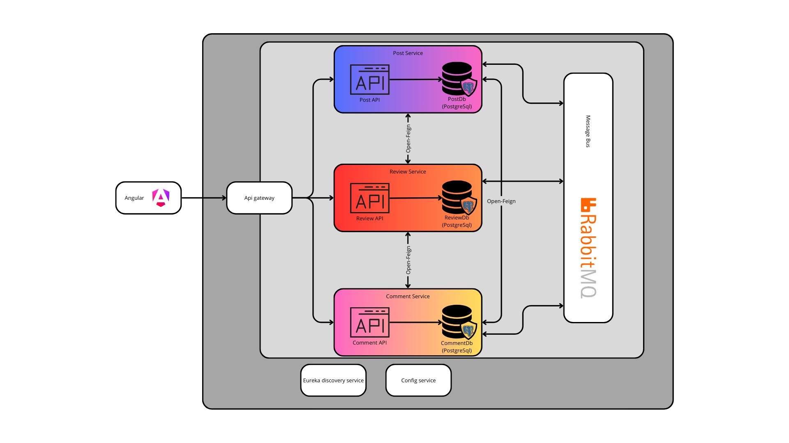

# Architectuur Overzicht

## 1. Frontend (Angular)
- **Beschrijving**: Het frontend is gebouwd met Angular en vormt de interface voor de eindgebruikers. Het communiceert met de backend via de API Gateway.
- **Communicatie**: Synchronous communicatie met de API Gateway.

## 2. API Gateway
- **Beschrijving**: De API Gateway fungeert als de enige toegangspoort voor het frontend om verbinding te maken met de backend-services. Het stuurt binnenkomende verzoeken door naar de juiste microservice (Post, Review of Comment Service).
- **Communicatie**: Synchronous communicatie tussen de frontend en de microservices.

## 3. Microservices
- **Post Service**:
  - **Beschrijving**: Beheert het maken, lezen, updaten en verwijderen van berichten.
  - **Database**: Heeft een eigen PostgreSQL database (PostDB) voor het opslaan van gegevens die gerelateerd zijn aan berichten.
- **Review Service**:
  - **Beschrijving**: Beheert de reviews voor berichten.
  - **Database**: Heeft een eigen PostgreSQL database (ReviewDB).
- **Comment Service**:
  - **Beschrijving**: Beheert de reacties op berichten.
  - **Database**: Heeft een eigen PostgreSQL database (CommentDB).
- **Opmerking**: Elke service is een zelfstandige microservice met een eigen database, wat onafhankelijk schalen en ontwikkelen mogelijk maakt.

## 4. Communicatie Tussen Services
- **OpenFeign**:
  Wanneer een GET-request wordt gedaan om een post op te halen, gebruikt de Post Service OpenFeign (synchrone communicatie) om de Review Service en Comment Service aan te roepen. Het haalt de gekoppelde reviews en reacties op basis van hun ID's op, combineert deze met de gegevens van de post en stuurt de volledige respons terug naar de API Gateway.
- **Message Bus (RabbitMQ)**:
  Wanneer een nieuwe reactie of review aan een post wordt toegevoegd, wordt een RabbitMQ-bericht naar de queue verzonden. De Post Service luistert naar de queue, werkt de betreffende post in zijn database bij door de nieuwe review- of reactie-ID te koppelen en slaat de wijzigingen op.
## 5. Eureka Discovery Service
- **Beschrijving**: Alle microservices registreren zich bij de Eureka Discovery Service, waardoor ze elkaar dynamisch kunnen ontdekken. Dit ondersteunt schaalbaarheid en flexibiliteit in servicecommunicatie.

## 6. Config Service
- **Beschrijving**: De Config Service centraliseert het configuratiebeheer voor alle microservices, wat helpt om de configuratiegegevens consistent te houden en het onderhoud te vereenvoudigen.

## Overzicht van Communicatietypes
- **Synchronous Communicatie**: Wordt afgehandeld door de API Gateway en OpenFeign. De frontend en microservices communiceren direct met elkaar wanneer onmiddellijke respons vereist is.
- **Asynchronous Communicatie**: Wordt afgehandeld door RabbitMQ, dat een message bus biedt voor taken die geen onmiddellijke respons vereisen, zoals achtergrondverwerking of notificaties.